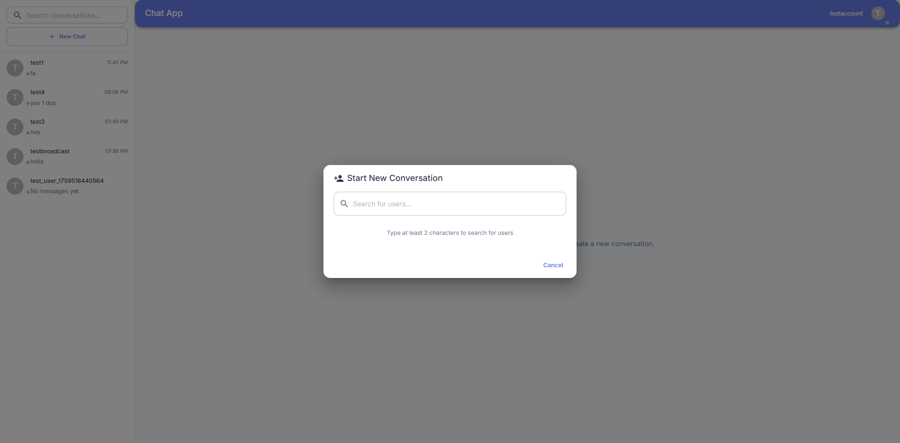

# Chat App Frontend

A modern, real-time chat application built with React, TypeScript, Material-UI, and Socket.IO.

## Features

- **Real-time messaging** with Socket.IO
- **User authentication** (Login/Register) with JWT
- **Responsive design** that works on desktop and mobile
- **Material-UI components** for a polished interface
- **Conversation management** with search functionality
- **Online/offline status** indicators
- **Unread message counts** and notifications
- **Message history** with pagination
- **User search** to start new conversations

## Tech Stack

- **React 19** with TypeScript
- **Material-UI (MUI)** for UI components
- **Socket.IO Client** for real-time communication
- **Axios** for HTTP requests
- **React Router** for navigation
- **Vite** for fast development and building

## Installation

### Prerequisites

- Node.js 20+ 
- npm or yarn
- Backend API server running (see backend documentation)

### Setup

1. **Clone the repository**
   ```bash
   git clone <repository-url>
   cd frontend
   ```

2. **Install dependencies**
   ```bash
   npm install
   ```

3. **Configure environment variables**
   Create a `.env` file in the root directory:
   ```env
   VITE_API_URL=http://localhost:3000
   VITE_SOCKET_URL=http://localhost:3000
   VITE_APP_NAME=Chat App
   VITE_APP_VERSION=1.0.0
   ```

4. **Start the development server**
   ```bash
   npm run dev
   ```

   The app will be available at `http://localhost:5173`

## Build for Production

```bash
# Build the app
npm run build

# Preview the production build
npm run preview
```

## Deployment

### Development

For development, use the standard Vite dev server:

```bash
# Start development server
npm run dev

# The app will be available at http://localhost:5173
```

### Production Deployment

For production deployment, use the Docker configuration in the `production/` folder:

```bash
# Navigate to production directory
cd production

# Create environment file
cp env.example .env

# Edit .env with your production values
nano .env

# Build and run
docker-compose build --no-cache frontend
docker-compose up -d frontend
```

**Production Configuration:**
- **Location**: `frontend/production/`
- **Network**: Connects to `backend_chat-network`
- **Port**: Configurable via `FRONTEND_PORT` (default: 3333)
- **Proxy**: Nginx proxies API requests to backend

### Environment Variables

| Variable | Description | Default | Required |
|----------|-------------|---------|----------|
| `VITE_API_URL` | API base URL for browser requests | `http://196.189.149.214:3000` | Yes |
| `VITE_SOCKET_URL` | WebSocket URL for browser requests | `http://196.189.149.214:3000` | Yes |
| `BACKEND_HOST` | Backend container name for nginx proxy | `chat-app-backend` | Yes |
| `BACKEND_PORT` | Backend container port | `3000` | Yes |
| `FRONTEND_PORT` | External port for frontend | `3333` | No |

### Health Checks

```bash
# Check frontend health
curl http://YOUR_SERVER_IP:3333

# Check container logs
docker logs chat-app-frontend

# Check container status
docker ps | grep frontend
```

For detailed production deployment instructions, see [production/README.md](production/README.md).


## Screenshots

### Authentication

#### Login Screen - Web

*Clean and modern login interface with form validation*

#### Login Screen - Mobile

*Responsive mobile login interface*

#### Register Screen - Web

*User registration with password confirmation and validation*

#### Register Screen - Mobile

*Mobile registration interface*

### Chat Interface

#### Chat Screen - Web

*Full desktop chat interface with sidebar and main chat window*

#### Chat Screen - Web (Alternative View)

*Desktop chat interface showing conversation details*

#### Chat Screen - Mobile

*Responsive mobile interface with collapsible sidebar*

### Conversation Management

#### Conversation Sidebar

*Conversation list with search, unread counts, and online status*

#### Search for Messages

*Search functionality to find specific messages in conversations*

### New Conversation

#### Start New Conversation - Web

*Create new conversation interface on desktop*

#### Start New Conversation - Mobile

*Mobile interface for starting new conversations*

#### User Search - Web

*Search for users to start conversations on desktop*

#### User Search - Mobile

*Mobile user search interface*


#### Profile Settings - Web

*User profile and settings interface*


## Project Structure

```
src/
├── components/           # Reusable UI components
│   ├── auth/            # Authentication components
│   ├── chat/            # Chat-related components
│   ├── common/          # Common/shared components
│   └── layout/          # Layout components
├── hooks/               # Custom React hooks
│   ├── useAuth.tsx      # Authentication context & hooks
│   └── useChat.tsx      # Chat context & hooks
├── pages/               # Page components
│   ├── Login.tsx        # Login page
│   ├── Register.tsx     # Register page
│   └── Chat.tsx         # Main chat page
├── services/            # API and external services
│   ├── api.ts           # HTTP client configuration
│   ├── auth.ts          # Authentication service
│   ├── chat.ts          # Chat API service
│   └── socket.ts        # Socket.IO service
├── types/               # TypeScript type definitions
│   └── index.ts         # All type definitions
├── config/              # Configuration files
│   └── env.ts           # Environment configuration
└── utils/               # Utility functions
```

## Configuration

### Environment Variables

| Variable | Description | Default |
|----------|-------------|---------|
| `VITE_API_URL` | Backend API base URL | `http://localhost:3000` |
| `VITE_SOCKET_URL` | Socket.IO server URL | `http://localhost:3000` |
| `VITE_APP_NAME` | Application name | `Chat App` |
| `VITE_APP_VERSION` | Application version | `1.0.0` |

### API Endpoints

The frontend expects the following API endpoints:

- `POST /api/auth/login` - User login
- `POST /api/auth/register` - User registration
- `GET /api/auth/me` - Get current user
- `POST /api/auth/logout` - User logout
- `GET /api/conversations` - Get user conversations
- `GET /api/conversations/:id` - Get specific conversation
- `GET /api/conversations/:id/messages` - Get conversation messages
- `POST /api/conversations` - Create new conversation
- `POST /api/conversations/:id/messages` - Send message
- `PUT /api/messages/mark-read` - Mark messages as read
- `GET /api/users/search` - Search users

### Socket.IO Events

**Client to Server:**
- `join-conversation` - Join a conversation room
- `leave-conversation` - Leave a conversation room
- `send-message` - Send a new message
- `mark-as-read` - Mark messages as read

**Server to Client:**
- `new-message` - Receive new message
- `message-read` - Message read confirmation
- `user-online` - User came online
- `user-offline` - User went offline
- `conversation-updated` - Conversation was updated

## Customization

### Theming

The app uses Material-UI's theming system. You can customize the theme in `src/App.tsx`:

```typescript
const theme = createTheme({
  palette: {
    primary: {
      main: '#1976d2', // Change primary color
    },
    secondary: {
      main: '#dc004e', // Change secondary color
    },
  },
  // Add more customizations
});
```

### Responsive Breakpoints

The app is responsive and uses Material-UI's breakpoint system:
- `xs`: 0px and up (mobile)
- `sm`: 600px and up (tablet)
- `md`: 900px and up (desktop)
- `lg`: 1200px and up (large desktop)
- `xl`: 1536px and up (extra large)

## Development

### Available Scripts

- `npm run dev` - Start development server
- `npm run build` - Build for production
- `npm run preview` - Preview production build
- `npm run lint` - Run ESLint

### Code Style

The project uses:
- **ESLint** for code linting
- **TypeScript** for type safety
- **Prettier** for code formatting (recommended)
`

### Debug Mode

Enable debug mode by setting localStorage:
```javascript
localStorage.setItem('debug', 'socket.io-client:*');
```
